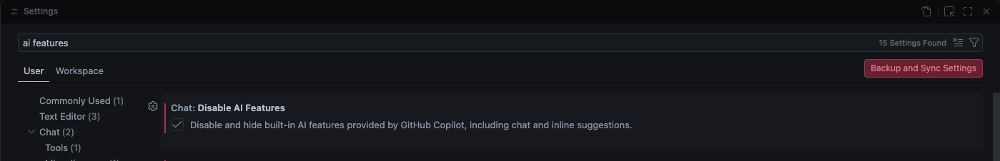
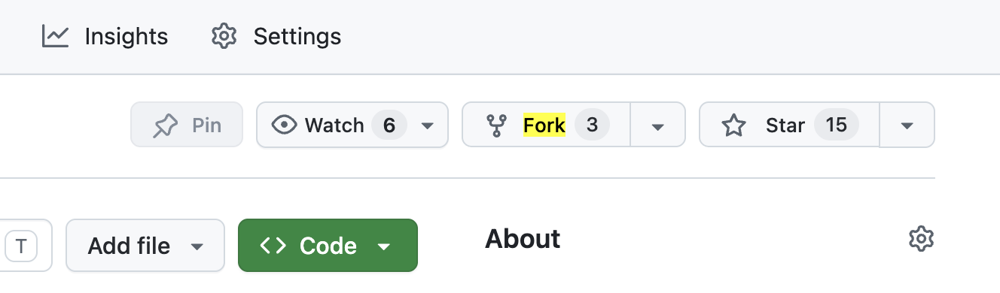
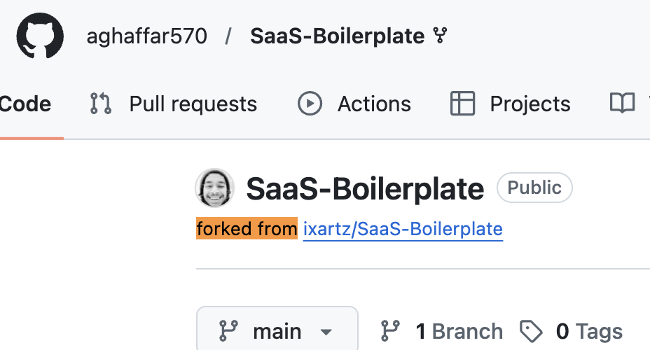

# Fundamentals Checkpoint

This is **not graded**. It is a checkpoint so your instructors can see where you are and where you need support. There is no penalty for leaving something blank or unfinished.

**Do your best and be honest.** If you finish everything, great. If you only get through Part 1, that is useful information too. What matters is that the work you submit is your own — not that it is perfect.

If you get stuck, leave a comment explaining what you tried and what confused you. That tells your instructors exactly where to focus their support.

Do not copy/paste any snippets. Please write your solutions out completely as this is good practice to see if you are familiar with the syntax.

---

**Do not use any AI tools, chats, hints, or autocomplete.**
> Please disable AI in your VSCode settings before starting:
>
> 

---

## The Three Parts

| Part | What it tests |
|------|--------------|
| Part 1 | Variables, arrays, objects, and methods in plain JavaScript |
| Part 2 | Writing HTML from scratch and linking + writing CSS |
| Part 3 | Selecting DOM elements, responding to events, and manipulating the page |

Read the instructions inside each file — they are written as comments.

---

## File Structure

```
ttp-checkpoint-1/
  part1-js/
    index.html        ← Open with Live Server to run your code in the browser
    index.js          ← JavaScript basics — write your code here
  part2-html-css/
    index.html        ← Build this from scratch
    look.css          ← Style from scratch — this name is intentional
  part3-dom/
    index.html        ← Pre-built — do not edit this file
    page.css          ← Add your styles here
    app.js            ← Write all your JavaScript here
```

---

## How to Submit

### Step 1 — Fork this repository

Click the **Fork** button at the top right of this page on GitHub. This creates your own copy of the repo under your GitHub account.



### Step 2 — Confirm your fork

After forking, you should be on your own copy of the repo. The URL and the header will show your username, not the original owner's.

Here is an example of what a forked repo should look like:



### Step 3 — Clone your fork

Open your terminal and run the following, replacing `<yourUsername>` with your GitHub username:

```
git clone https://github.com/<yourUsername>/ttp-checkpoint-1.git
```

Then move into the project folder:

```
cd ttp-checkpoint-1
```

### Step 4 — Confirm your remote is correct

Run this command to check that your local repo is pointing to your fork, not the original:

```
git remote -v
```

You should see your username in the URL:

```
origin  https://github.com/<yourUsername>/ttp-checkpoint-1.git (fetch)
origin  https://github.com/<yourUsername>/ttp-checkpoint-1.git (push)
```

If the URL still shows the original owner's username, stop and ask an instructor before continuing.

### Step 5 — Do your work

Work inside the files as they are. Do not rename any files or folders.

### Step 6 — Commit and push your work

After completing each part, commit and push your changes. Make sure you are inside the `ttp-checkpoint-1` folder in your terminal when you run these commands:

```
git add .
git commit -m "part 1 complete"
git push
```

Repeat after each part, or push everything at the end — either is fine.

### Step 7 — Submit your link

Submit the URL to **your forked repo**. It should look like this:

```
https://github.com/<yourUsername>/ttp-checkpoint-1
```

Do not submit the original repo link. If your username is not in the URL, it is the wrong link.
